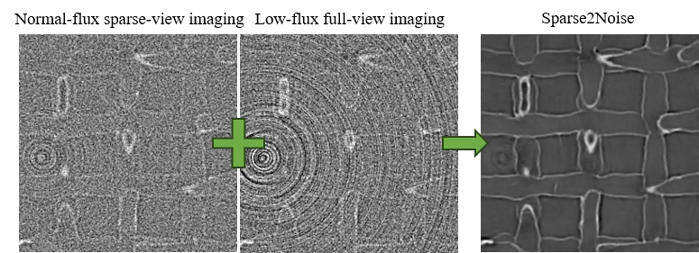

# Sparse2Noise
Low-dose synchrotron X-ray tomography without high-quality reference data


Paper: to be published

## Setup Environemnets:

* create your virtual environment and install dependencies: 
  ```
  1. Open a terminal or command prompt.
  2. Navigate to the directory where you want to create the virtual environment (usually the path contains your script).
  3. Run the following command to create a new virtual environment: 
     /usr/bin/python3.6 -m venv venv
  4. Activate the virtual environment:
     source /.../venv/bin/activate
  6. Once the virtual environment is activated, run the following command to install the dependencies from the provided requirements.txt file:
     pip install --upgrade pip
     pip install -r requirements.txt
          or pip install numpy tensorflow imageio scipy tifffile
  ```
## Dataset (h5):
Test data 241train-scaffolds-sparse2noise.h5 can be downloaded from [here](https://drive.google.com/drive/folders/1sTI0Lv8VJzcGcavJ6NhfaorBv5ZLYfZj): 
  ```
  h5dump -H 241train-scaffolds-sparse2noise.h5
  HDF5 "241train-scaffolds-sparse2noise.h5" {
  GROUP "/" {
     DATASET "test_gt" {
        DATATYPE  H5T_STD_U8LE
        DATASPACE  SIMPLE { ( 5, 256, 256 ) / ( 5, 256, 256 ) }
     }
     DATASET "test_ns" {
        DATATYPE  H5T_STD_U8LE
        DATASPACE  SIMPLE { ( 5, 256, 256 ) / ( 5, 256, 256 ) }
     }
     DATASET "train_gt" {
        DATATYPE  H5T_STD_U8LE
        DATASPACE  SIMPLE { ( 241, 256, 256 ) / ( 241, 256, 256 ) }
     }
     DATASET "train_ns" {
        DATATYPE  H5T_STD_U8LE
        DATASPACE  SIMPLE { ( 241, 256, 256 ) / ( 241, 256, 256 ) }
     }
  }
  }
*train_ns*: Normal-flux sparse-view CT reconstruction images for training
_train_gt_: Low-flux full-view CT reconstruction images for training
_test_ns_: Normal-flux sparse-view CT reconstruction images for test
_test_gt_: Normal-flux sparse-view CT reconstruction images for test
  ```
## Train:

* run main.py, an example:
  ```
  python main.py -h5fn 241train-scaffolds-sparse2noise.h5
  ```
  Now you should have a folder /Output/<your dataset's name>
## Example:


# Reference
    The tensorflow implementation, [https://github.com/lzhengchun/TomoGAN](https://github.com/lzhengchun/TomoGAN)

